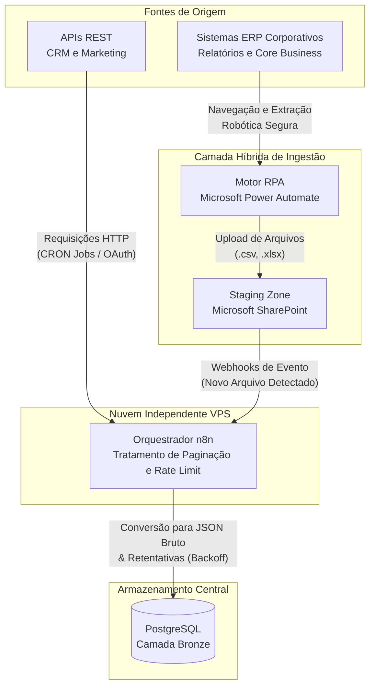
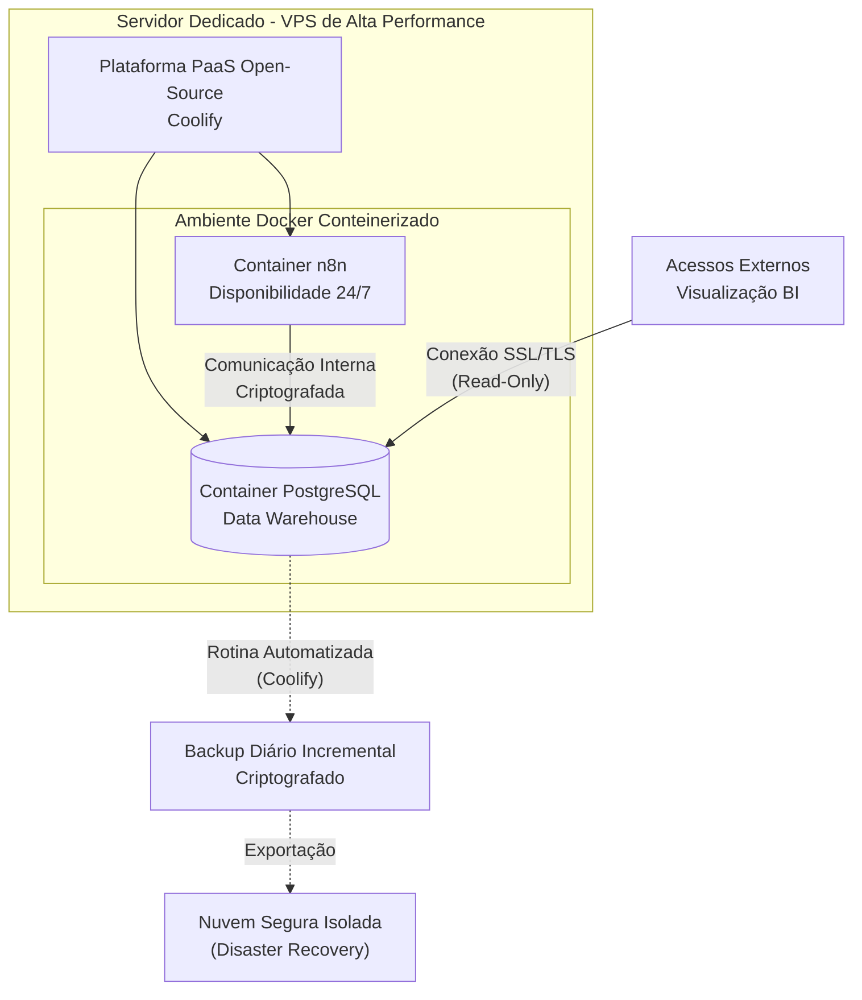
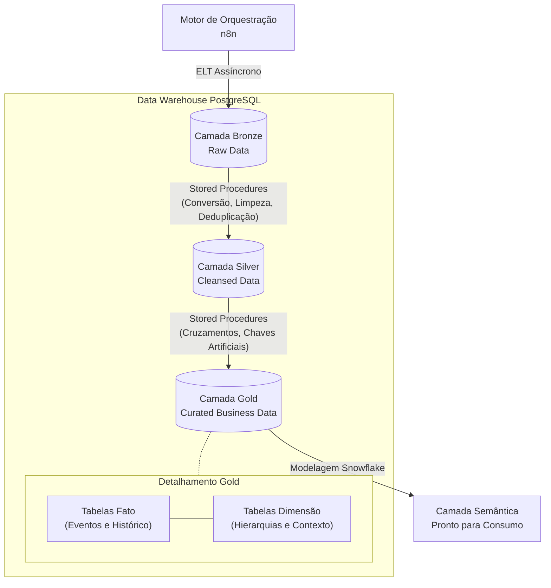
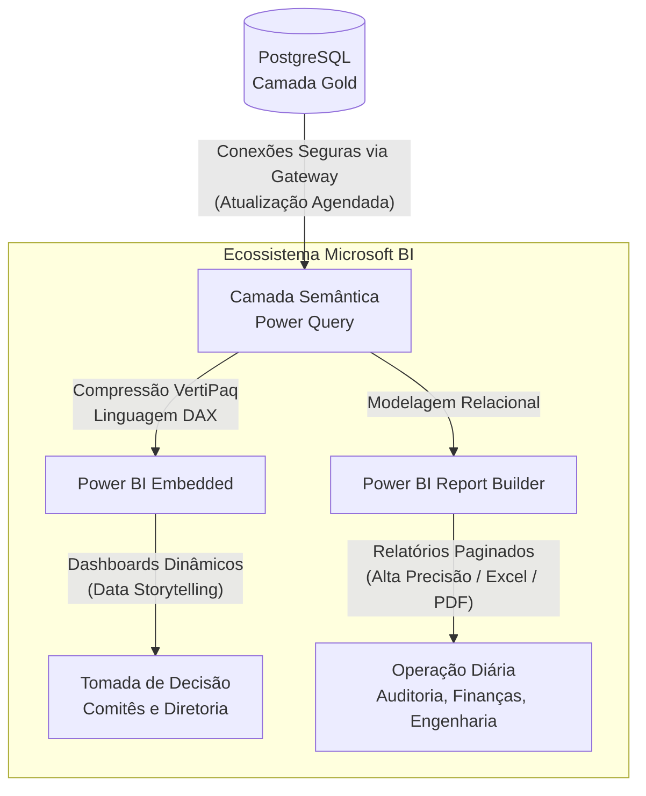

# 📑 Case Study: Do Caos dos Dados à Cultura Data-Driven na Construção Civil

## 🎯 O Desafio: Fragmentação Extrema e Tomada de Decisão por *Feeling*

Ao assumir o desafio estratégico de estruturar uma nova área de Inteligência, Pesquisa Comercial e Negócios em um player de grande porte do setor de incorporação e construção civil, o cenário encontrado refletia um problema clássico desse mercado: a coexistência de múltiplos sistemas operando em silos herméticos, sem centralização ou governança unificada. A companhia passava por um momento crucial de expansão e reestruturação interna, com o objetivo claro de introduzir a automação de processos, otimizar a eficiência operacional sob os preceitos da metodologia Lean e pavimentar o caminho para o crescimento escalável. Contudo, a descentralização dos ativos de dados agia como uma barreira para essa modernização.

No nível operacional e gerencial, a infraestrutura analítica precisava ser construída do zero. Não havia um repositório histórico comum ou uma "única fonte da verdade" (Single Source of Truth). A tomada de decisão em comitês executivos dependia de relatórios extraídos de forma reativa, muitas vezes construídos com base em dados fragmentados que demandavam consolidação manual. Na ausência de uma base unificada e automatizada, a cultura corporativa dependia massivamente da sólida experiência empírica e do conhecimento de mercado das lideranças de cada setor. Embora essa visão de mercado fosse valiosa, o modelo trazia desafios analíticos naturais, como a complexidade para prever tendências com precisão preditiva, mensurar o ROI exato de campanhas de marketing de forma ágil e obter visibilidade em tempo real sobre o ciclo de vida das vendas.

A raiz desse desafio estava na heterogeneidade das fontes de dados, que formavam um ecossistema complexo de sistemas legados e plataformas modernas convivendo de forma isolada:

* **Sistemas ERP Corporativos:** No coração financeiro e operacional, a empresa utilizava ERPs corporativos de grande porte e robustez de mercado. Estes sistemas, embora consolidados para as rotinas administrativas, fiscais e contábeis de uma grande operação, funcionavam de maneira descentralizada para fins analíticos. As informações financeiras, de custos de obras e de contratos ficavam retidas dentro de seus respectivos módulos, exigindo consultas complexas apenas para a extração de relatórios nativos e rígidos.
* **Plataformas de Vendas e CRM:** No front comercial, as dinâmicas de atendimento e comercialização de unidades geravam dados em softwares especialistas e plataformas de nuvem modernas. O estoque de lotes, o andamento das propostas e os contratos de compra e venda eram gerenciados em um sistema focado em estoque imobiliário, enquanto o funil de marketing e o relacionamento com potenciais clientes eram operados em plataformas líderes de CRM e automação de marketing.
* **Silos Operacionais e Planilhas Eletrônicas:** O elo que tentava unir esses diferentes mundos era composto por planilhas eletrônicas descentralizadas, armazenadas em nuvens corporativas ou redes locais. Informações cruciais de pesquisas de mercado concorrenciais, tabelas de preços dinâmicas e metas internas eram registradas manualmente por analistas de diferentes áreas, gerando arquivos em formatos divergentes (.csv, .xlsx, .json brutos) contendo dados estruturados e semiestruturados.

O maior obstáculo para a resolução desse quebra-cabeça era a ausência de uma infraestrutura básica de engenharia de dados e de chaves de acesso a APIs configuradas para consumo externo. Vindo de um background analítico voltado à gestão, percebi imediatamente que essa dispersão técnica não era apenas um desafio de infraestrutura, mas sim um gargalo estratégico de negócios que limitava o potencial de expansão escalável da companhia. Unindo essa sensibilidade de negócios ao desejo de arquitetar uma solução real, posicionei-me para desenhar e executar um pipeline de dados end-to-end capaz de unificar todos esses silos e consolidar uma cultura estritamente orientada a dados.

## 🛠️ A Arquitetura da Solução (Stack End-to-End)

Para transformar o cenário de fragmentação em um ecossistema analítico de alta performance, projetei e implementei uma arquitetura de dados moderna, robusta e totalmente integrada de ponta a ponta (end-to-end). O desenho desta solução foi estratégico e pautado pela eficiência, pois operou sob restrições técnicas, orçamentárias e de governança específicas. O principal desafio institucional era a necessidade de estabelecer uma estrutura analítica do zero, sem impactar a infraestrutura de servidores locais existente e respeitando o foco da equipe interna de tecnologia, que estava dedicada à sustentação e manutenção dos sistemas core business corporativos. Adicionalmente, as diretrizes de segurança demandavam que o processamento ocorresse fora do ambiente operacional diário dos usuários locais.

Diante dessas barreiras, adotei uma estratégia baseada em três pilares fundamentais: autonomia arquitetural, eficiência de custos através de softwares de código aberto (Open-Source Software - OSS) e redução da complexidade operacional por meio de componentes Low-Code de nível empresarial. As diretrizes práticas para a construção dessa engrenagem foram derivadas dos conhecimentos avançados absorvidos ao longo da minha especialização e pós-graduação na área de dados. Essa formação foi primordial para que eu pudesse traduzir conceitos teóricos complexos de governança, modelagem dimensional e processamento de dados em uma infraestrutura tangível, escalável e segura.

A espinha dorsal da arquitetura foi estruturada para suportar o fluxo contínuo do dado, desde o seu estado bruto na origem até a camada final de inteligência de negócios. O ecossistema foi desenhado seguindo uma topologia em camadas que orquestra a ingestão, o armazenamento, a transformação e a entrega dos ativos de informação:

* **Camada de Conectividade e Captura Dinâmica:** Onde as plataformas modernas baseadas em nuvem e os sistemas de core business (ERPs e CRMs) são acessados. Para viabilizar o consumo automatizado, essa camada foi projetada para ser elástica, combinando webhooks, requisições HTTP programadas e rotinas estruturadas para coletar o dado onde quer que ele estivesse armazenado.
* **Camada de Ingestão e Orquestração Assíncrona:** Centralizada em um motor de automação de fluxos de trabalho configurado em ambiente em nuvem isolado da rede local. Essa camada atua como o maestro do pipeline, responsável por disparar os gatilhos de captura em horários agendados, gerenciar as tentativas de reconexão em caso de oscilações nas APIs e mover a massa de dados em direção ao repositório central sem sobrecarregar os sistemas de produção (OLTP).
* **Camada de Armazenamento e Refinamento Progressivo (Repositório Central):** Hospedada em um ambiente virtualizado privado, esta camada adota o padrão de mercado conhecido como Arquitetura Medallion (Medallion Architecture). O armazenamento utiliza um banco de dados relacional robusto, configurado especificamente para atuar como o Data Warehouse analítico. O banco foi subdividido logicamente em esquemas estritos (Bronze, Silver e Gold), onde o dado sofre um processo de purificação gradual e incremental à medida que transita entre os estágios.
* **Camada de Modelagem Semântica e Consumo:** Onde as tabelas tratadas do banco de dados são traduzidas em conceitos claros de negócios. Utilizando técnicas de modelagem dimensional avançadas, os dados consolidados ganham um formato semântico otimizado para consultas rápidas e cruzamentos multidimensionais complexos, preparando o terreno para a extração de inteligência sem a necessidade de reprocessamentos pesados na ponta final.
* **Camada de Entrega e Business Intelligence Visual:** A interface de consumo final para o corpo executivo, gerencial e operacional. Esta camada se conecta diretamente à estrutura de dados otimizada e serve painéis analíticos altamente interativos e relatórios operacionais formatados (paginados) de alta precisão. Os relatórios são atualizados de forma totalmente automatizada, garantindo que os tomadores de decisão tenham acesso a indicadores em tempo real (ou próximo ao real) de forma consistente.

Essa arquitetura end-to-end não apenas resolveu o problema técnico da dispersão dos dados, mas também estabeleceu uma fundação escalável. O design foi concebido com uma mentalidade de microsserviços e conteinerização, o que significa que sua base é moderna o suficiente para permitir migrações futuras para ferramentas de orquestração puramente baseadas em código (como o Mage.ai) ou a expansão para volumes de Big Data sem a necessidade de refazer o trabalho estrutural. Foi o casamento perfeito entre a visão analítica de negócios e o rigor técnico da engenharia de dados.

### 1. Ingestão e Orquestração (Data Ingestion)

A camada de Ingestão e Orquestração de dados representou o primeiro grande desafio técnico de engenharia de software dentro do projeto, funcionando como a porta de entrada de todo o fluxo de inteligência. O objetivo principal era construir um pipeline de captura robusto, tolerante a falhas e assíncrono, capaz de extrair informações de sistemas completamente heterogêneos sob um cenário específico: a necessidade de criar acessos de leitura estruturados e o alinhamento rigoroso com as políticas de segurança corporativas, que demandavam o processamento e a execução de códigos e scripts fora das estações de trabalho locais dos usuários.

Para superar esses bloqueios técnicos com total conformidade e segurança, adotei uma estratégia de arquitetura híbrida e descentralizada, combinando o poder de ferramentas de automação empresarial com o dinamismo de plataformas Open-Source avançadas hospedadas em nuvem de forma independente. O coração dessa engrenagem de orquestração foi estruturado por meio de três componentes principais que trabalhavam em perfeita sinergia:

* **n8n (Hospedado em Ambiente Próprio via VPS):** O n8n atuou como o motor principal de orquestração de fluxos de trabalho (Workflow Engine) e o gateway de integração de APIs. Sendo uma ferramenta extensível e baseada em nós, ele foi configurado para disparar requisições HTTP programadas (via CRON jobs) para coletar dados de plataformas modernas que possuíam APIs REST acessíveis, como os sistemas de CRM e a plataforma de automação de marketing. O n8n geria todo o ciclo de vida da requisição: realizava a autenticação via OAuth ou Bearer Tokens, tratava as respostas paginadas (Pagination Handling) para garantir a captura de grandes volumes de registros e implementava lógicas de controle de taxa de requisições (Rate Limiting) para evitar bloqueios ou sobrecargas nos servidores de origem.
* **Microsoft Power Automate (Camada RPA e Gateways Internos):** Para os sistemas que não disponibilizavam APIs públicas facilitadas ou cujos dados estavam concentrados em relatórios internos rígidos dentro dos ERPs corporativos, o Power Automate foi a peça-chave. Ele funcionou como uma camada de Automação de Processos Robóticos (RPA), simulando rotinas seguras de login, navegação e extração de relatórios gerenciais nativos dessas plataformas. Adicionalmente, ele atuou como um despachante de dados dentro do ecossistema corporativo, monitorando e integrando informações onde o acesso de leitura analítica era viabilizado.
* **Microsoft SharePoint:** Utilizado estrategicamente como uma zona de pouso intermediária (Staging Zone de arquivos brutos). Os fluxos automatizados extraíam relatórios estruturados (em formatos como .csv e .xlsx) e os alocavam em pastas monitoradas no SharePoint. A partir daí, o n8n entrava em ação por meio de webhooks de evento: assim que um novo arquivo era detectado na pasta, o n8n iniciava o download assíncrono do documento, lia o conteúdo binário, convertia a estrutura em objetos JSON brutos e iniciava o processo de transmissão para o repositório central.

A grande sofisticação dessa camada de ingestão residia na sua capacidade de resiliência e tratamento de erros. Em engenharia de dados, falhas de rede, APIs temporariamente fora do ar e mudanças inesperadas em esquemas de dados são ocorrências normais. Para blindar o pipeline, configurei políticas estritas de tentativas de reexecução com recuo exponencial (Exponential Backoff Retries) diretamente nos fluxos do n8n. Se a API de origem falhasse em responder, o orquestrador não interrompia o pipeline; ele agendava novas tentativas automáticas espaçadas no tempo e, caso o erro persistisse após um limite seguro, disparava alertas estruturados com logs detalhados do erro.

Toda a massa de dados coletada por essas diferentes frentes (requisições de API diretas, payloads de webhooks e leituras de arquivos brutos) era convertida pelo n8n em um formato padronizado e injetada, via conexões de rede seguras, diretamente na primeira camada de armazenamento do banco de dados (a camada Bronze do repositório central). Esse design assíncrono isolou completamente a extração de dados da transformação, garantindo que o histórico dos dados extraídos estivesse preservado e que a pipeline de BI não quebrasse de forma catastrófica diante de instabilidades externas.

### 2. Infraestrutura e Armazenamento (Storage)

A criação de um repositório centralizado de dados exigia uma infraestrutura de computação dedicada que pudesse atuar como o coração operacional de toda a stack. Para viabilizar o projeto com total autonomia técnica e otimização dos custos operacionais, adotei uma estratégia de infraestrutura auto-hospedada (*Self-Hosted*), projetando um ambiente de nuvem privada escalável e de altíssimo desempenho baseado inteiramente em Softwares de Código Aberto (OSS). Essa abordagem garantiu agilidade na implementação sem a necessidade de investimentos imediatos em serviços gerenciados de nuvem proprietária de alto custo.

O alicerce dessa camada de armazenamento foi estruturado a partir da contratação e configuração de uma VPS (*Virtual Private Server*) dedicada de alta performance. Para realizar a governança, o provisionamento de recursos e o gerenciamento dessa máquina virtual com agilidade e controle, implementei o Coolify. O Coolify é uma plataforma moderna de PaaS (*Platform as a Service*) open-source, amplamente utilizada no mercado como uma alternativa independente de implantação. Através dele, criei um ambiente totalmente conteinerizado (baseado em Docker), o que me permitiu isolar as aplicações, gerenciar recursos de memória e CPU com precisão, configurar firewalls de rede e automatizar rotinas de segurança com alta eficiência.

Dentro desse ecossistema controlado e orquestrado pelo Coolify na VPS, instalei e configurei os dois motores fundamentais que sustentaram a arquitetura de armazenamento e execução:

* **Instância do n8n (Orquestrador Conteinerizado):** Hospedado diretamente na VPS, o n8n ganhou o poder computacional necessário para processar grandes volumes de objetos JSON e cargas de rede complexas sem sofrer com gargalos de latência. A execução nesse ambiente independente garantiu a conformidade com as diretrizes locais de segurança corporativa, mantendo a disponibilidade de 24 horas por dia, 7 dias por semana, para a execução dos pipelines de dados programados.
* **PostgreSQL (O Data Warehouse Relacional):** Escolhi o PostgreSQL como o motor de banco de dados central para atuar como o Data Warehouse analítico do projeto. O PostgreSQL é amplamente reconhecido no mercado por sua robustez, estabilidade, suporte a queries SQL complexas e capacidade de lidar nativamente com dados estruturados (tabelas relacionais) e semiestruturados (através do tipo de dado JSONB). A instância foi otimizada com configurações específicas de alocação de memória (como `shared_buffers` e `work_mem`) para suportar cargas intensas de leitura e gravação assíncronas vindas dos pipelines de ingestão.

Para garantir a segurança cibernética e a integridade das informações estratégicas armazenadas no PostgreSQL, a infraestrutura foi blindada com rígidos protocolos de acesso. A conexão direta à porta padrão do banco de dados foi fechada para a internet externa, permitindo apenas a comunicação interna criptografada entre o container do n8n e o container do PostgreSQL dentro da própria rede virtual criada pelo Coolify na VPS. Os acessos externos permitidos (como o consumo de dados pela ponta final de Analytics) foram configurados utilizando chaves de criptografia SSL/TLS e credenciais de usuários com privilégios estritamente limitados a visualizações de leitura (*Read-Only*), aplicando o princípio do menor privilégio.

Além da segurança de acesso, implementei uma política rigorosa de tolerância a falhas e recuperação de desastres (*Disaster Recovery*). Utilizando as facilidades de automação da VPS e do Coolify, estruturei uma rotina de Backups diários e incrementais de toda a base de dados do PostgreSQL, bem como das configurações e fluxos de trabalho do n8n. Esses arquivos de backup eram criptografados e exportados automaticamente para um repositório de armazenamento seguro e isolado em nuvem. Essa arquitetura de storage auto-hospedada entregou um ambiente com estabilidade e segurança de nível corporativo, provando que a engenhosidade arquitetural somada às ferramentas open-source certas pode viabilizar projetos complexos de engenharia de dados com alta eficiência de custos.

### 3. Pipeline de Dados e Engenharia ETL (Arquitetura Medallion)

A transformação, o refino e a padronização dos dados brutos dentro da nossa VPS baseada em PostgreSQL seguiram as mais rigorosas boas práticas da engenharia de dados moderna, materializadas através da implementação da **Arquitetura Medallion** (*Medallion Architecture*). O grande desafio técnico desta etapa residia na extrema heterogeneidade das fontes de origem: o pipeline precisava receber layouts rígidos de tabelas vindas dos ERPs corporativos, payloads dinâmicos e profundamente aninhados em formato JSON originários das APIs de marketing e vendas, e registros manuais provenientes de planilhas integradas via SharePoint.

Para processar esse volume de dados com eficiência e em total conformidade com as diretrizes locais de segurança corporativa — que restringiam a execução de scripts em linguagens de programação nas estações de trabalho locais —, adotei uma estratégia de computação baseada no conceito de **ELT (Extract, Load, Transform)**. Em vez de processar as transformações na memória de uma aplicação intermediária local, utilizei o orquestrador n8n em nuvem puramente para extrair e carregar os dados brutos para dentro do banco de dados e deleguei todo o trabalho pesado de processamento para o próprio motor do **PostgreSQL**, utilizando o poder computacional de queries SQL altamente otimizadas e **Stored Procedures** (Procedimentos Armazenados) nativos executados de forma sequencial e em lote.

A governança e a purificação dos dados foram estruturadas através da divisão lógica do banco de dados em três esquemas estritos, simulando o ciclo de vida dos dados em um Data Lakehouse moderno:

* **Camada Bronze (Raw Data / Dados Brutos):** Esta é a zona de pouso inicial de todos os dados extraídos pelo pipeline de ingestão. O n8n inseria os dados exatamente como eles vinham da origem. Para as APIs REST, os payloads eram despejados diretamente em colunas estruturadas com o tipo de dado `JSONB` do PostgreSQL, o que garantia que nenhuma informação fosse perdida por quebra de schema. Para os relatórios estruturados e planilhas, os dados eram carregados em tabelas temporárias brutas de texto, preservando o histórico exato do momento da extração, sem qualquer validação ou higienização prévia.
* **Camada Silver (Cleansed and Conformed Data / Dados Tratados):** A transição da camada Bronze para a Silver era totalmente orquestrada pelo n8n invocando **Stored Procedures** que desenvolvi dentro do PostgreSQL. Essas procedures encapsulavam regras complexas de limpeza de dados: conversão de tipos de dados (como transformar textos de datas em timestamps válidos), padronização de codificação de caracteres (UTF-8), tratamento de valores nulos ou ausentes, eliminação de registros duplicados e remoção de caracteres especiais em campos de texto. Além disso, as procedures faziam a conformidade dos dados, extraindo informações de dentro dos campos `JSONB` brutos por meio de operadores nativos do PostgreSQL (`->>` e `@>`) e espelhando-as em colunas relacionais limpas e tipadas.
* **Camada Gold (Curated Business Data / Dados de Negócio Modelados):** Na transição final da camada Silver para a Gold, o dado passava de um formato puramente higienizado para uma estrutura de alto valor analítico, moldada especificamente para atender às regras e métricas estratégicas de negócios da área de Inteligência Comercial e Inovação. O processamento desta camada era executado por um segundo bloco de **Stored Procedures**, responsável por consolidar e cruzar os dados de sistemas historicamente isolados. Era neste estágio que as informações de atração de leads e oportunidades do CRM eram integradas à disponibilidade de estoque imobiliário e validadas contra os registros de faturamento e contratos consolidados nos ERPs da companhia.

Para suportar esse cruzamento multidimensional complexo na camada Gold, apliquei conceitos avançados de modelagem de dados, estruturando o banco sob o modelo **Snowflake (Floco de Neve)**. As Stored Procedures quebravam os dados em tabelas relacionais altamente eficientes:

* **Tabelas Fato (Fact Tables):** Centralizavam os eventos quantificáveis e históricos da operação, como o volume de vendas de unidades, o histórico de interações com clientes, o fluxo de faturamento mensal e o andamento físico-financeiro de projetos.
* **Tabelas Dimensão (Dimension Tables):** Circundavam as tabelas fato, fornecendo o contexto detalhado para as análises, estruturadas em hierarquias complexas (como a dimensão tempo, a dimensão empreendimento/produto, a dimensão equipe comercial e a dimensão perfil de cliente).

O uso coordenado de n8n e Stored Procedures no PostgreSQL criou um motor ETL/ELT assíncrono extremamente robusto. Esse ecossistema foi capaz de processar milhões de registros de forma incremental, mantendo a integridade referencial dos dados entre sistemas de fabricantes diferentes através de chaves artificiais (*Surrogate Keys*) geradas em banco de dados, entregando uma base de dados limpa, rápida e blindada contra falhas para a camada final de consumo analítico.

### 4. Consumo e Visualização (Analytics & BI)

A camada de Consumo e Visualização de dados foi projetada para ser a vitrine tecnológica de toda a stack e o ponto de virada definitivo na cultura organizacional. Após trafegar por pipelines complexos de ingestão, infraestrutura auto-hospedada e processos de transformação estruturados em Stored Procedures na base PostgreSQL, o dado purificado e modelado na camada Gold precisava ser entregue às lideranças em um formato que unisse altíssima performance técnica com uma experiência de usuário (UX) intuitiva e voltada para negócios.

O ecossistema de entrega e Business Intelligence foi arquitetado utilizando soluções avançadas do ecossistema Microsoft Power BI, dividindo-se em duas frentes complementares que atendiam tanto a demandas estratégicas quanto a necessidades puramente operacionais:

* **Power Query (Camada de Conectividade e Modelagem Semântica Final):** O consumo dos dados da camada Gold do PostgreSQL começava no Power Query. Estabelecendo uma conexão otimizada via gateways seguros, o Power Query funcionava como o tradutor final entre o banco de dados e a camada visual do BI. Em vez de realizar transformações pesadas ou processamentos de dados em memória dentro do Power BI — o que tornaria os relatórios lentos e pesados —, utilizei o Power Query estritamente para carregar as tabelas Fato e Dimensão previamente tratadas no PostgreSQL. Nesta etapa, apliquei conceitos avançados de compressão VertiPaq do Power BI, definindo tipos de dados estritos e organizando os relacionamentos do modelo Snowflake diretamente na ferramenta. O uso do Power Query serviu para aplicar os últimos ajustes semânticos (renomeação de colunas com termos de negócio legíveis para o usuário final) e para criar métricas e indicadores de performance complexos (KPIs) escritos em linguagem DAX (Data Analysis Expressions), como o cálculo do Custo de Aquisição de Clientes (CAC), Lifetime Value (LTV), taxa de conversão do funil de vendas e velocidade de vendas de unidades por empreendimento.
* **Power BI Embedded (Visualização Estratégica e Democratização dos Dados):** Para os painéis analíticos focados na diretoria, gerência e comitês executivos, implementei o Power BI Embedded. Essa abordagem permitiu incorporar os relatórios e painéis dinâmicos diretamente em portais corporativos acessíveis pelas lideranças, garantindo uma experiência de navegação integrada e centralizada. Os dashboards foram desenvolvidos sob rigorosos preceitos de Data Storytelling e Design de Dashboards, organizando as informações em fluxos de leitura lógicos: visões macro (métrica principal de faturamento, vendas ou leads) no topo da página, seguidas por quebras detalhadas (gráficos de tendência temporal, comparativos entre filiais ou empreendimentos) e tabelas granulares na base para análises detalhadas. Isso garantiu que o board executivo pudesse, em poucos segundos de leitura, identificar a saúde financeira e comercial da empresa e realizar o "drill-down" (aprofundamento dos dados) até o nível de um contrato ou lead específico se necessário.
* **Power BI Report Builder (Relatórios Operacionais e Paginados de Alta Precision):** Enquanto os dashboards dinâmicos eram ideais para a tomada de decisões rápidas e identificação de tendências, a operação diária e as equipes de auditoria, finanças e engenharia exigiam relatórios operacionais detalhados, rígidos e formatados sob medida para impressão ou exportação (em PDF ou Excel). Para suprir essa demanda com excelência, utilizei o Power BI Report Builder para desenvolver Relatórios Paginados (Paginated Reports). Esses relatórios eram conectados diretamente à base Gold e geravam listagens complexas de faturamento por obra, fluxo de caixa diário, balanços de estoque disponível e listas de recebíveis. O Report Builder permitiu configurar layouts com paginação exata, cabeçalhos repetidos por folha, agrupamentos complexos e formatação condicional cirúrgica, garantindo o atendimento perfeito aos requisitos operacionais e de governança mais rígidos da companhia.

Para sustentar essa ponta final com total independência e dinamismo, configurei políticas de atualização agendada automática (Data Refresh Scheduled) sincronizadas com o término das Stored Procedures do banco de dados na VPS. O fluxo de dados operava de forma que, no início de cada dia ou período programado, os dados já estavam atualizados e disponíveis para consumo. O resultado foi a erradicação total de falhas em apresentações ou disparidades de números entre os setores: comercial, marketing e finanças passaram a ler exatamente os mesmos dados, vindos do mesmo modelo, estabelecendo uma governança analítica impecável e de nível corporativo.

## 🚀 Impacto Prático e Resultados de Negócio

A implementação bem-sucedida desta stack de dados end-to-end provocou uma verdadeira evolução operacional e cultural no negócio, redefinindo a forma como os departamentos interagiam entre si e como o board executivo desenhava o futuro estratégico da companhia. O projeto converteu um cenário histórico de descentralização de informações em um ambiente de alta eficiência, gerando impactos práticos mensuráveis e transformações profundas que se estenderam por toda a cadeia de valor da empresa.

A evolução da maturidade analítica da organização pode ser dividida em marcos práticos e claros:

* **Automação Integral do Ciclo de Vida do Dado:** O impacto operacional mais imediato foi a completa eliminação do trabalho manual repetitivo. Antes do desenvolvimento da stack, as equipes de marketing, vendas e finanças dedicavam dezenas de horas semanais realizando extrações isoladas, tratando inconsistências no Excel e cruzando dados manualmente para montar apresentações de resultados — que muitas vezes já nasciam obsoletas. O ecossistema evoluiu drasticamente: passou de um cenário com forte dependência de processos manuais para uma estrutura de dashboards atualizados sob demanda, culminando em um ambiente analítico **100% automático**. O pipeline passou a operar em background de forma silenciosa e contínua, liberando o time de analistas das tarefas operacionais de digitação e permitindo que focassem exclusivamente na análise estratégica dos dados.
* **Centralização de Sistemas e Unificação da Verdade (Single Source of Truth):** Ao conectar e correlacionar bases historicamente isoladas (como os ERPs corporativos, sistemas de estoque imobiliário e os ecossistemas de marketing e CRM) em um único modelo de dados Snowflake na camada Gold, o projeto eliminou um dos maiores problemas de governança da empresa: a divergência de métricas. Reuniões de diretoria que antes geravam discussões sobre a origem ou validade de um número de vendas ou faturamento foram substituídas por debates puramente estratégicos. A stack garantiu que o marketing visualizasse o impacto real de suas campanhas no faturamento consolidado, e que o financeiro pudesse antecipar projeções de receita com base no funil ativo de oportunidades do CRM, unificando a linguagem corporativa.
* **Transição Cultural para uma Gestão Estritamente Data-Driven:** O maior sucesso e legado do projeto foi a mudança de mentalidade da liderança da companhia. A tomada de decisões da alta gestão, que antes contava fortemente com a intuição empírica e o histórico profissional dos gestores devido à falta de dados consolidados, foi integralmente substituída por uma cultura de tomada de decisão **100% orientada a dados**. Cada lançamento imobiliário, alteração de tabela de preços, alocação de orçamento de mídia ou revisão de metas comerciais passou a ser obrigatoriamente precedida pela análise dos indicadores históricos e preditivos exibidos nas telas do Power BI.
* **Implementação da Filosofia Lean na Prática:** Sob o escopo de otimização de processos e Lean que motivou a criação da área de Inteligência de Negócios, a stack atuou como um scanner de ineficiências. Com dados transparentes e cruzados de ponta a ponta, a gerência pôde mapear com precisão o tempo médio de conversão de cada etapa do funil de vendas, identificar quais canais comerciais apresentavam maior ociosidade ou gargalos de atendimento no sistema de estoque, e detectar desvios orçamentários operacionais em tempo real antes que eles impactassem o balanço consolidado de final de mês.

Em termos de governança e escalabilidade, o projeto provou que é possível atingir níveis corporativos de controle de BI com alto retorno sobre o investimento por meio do uso estratégico de ferramentas open-source. A empresa passou a operar com a certeza de que seus dados estavam protegidos, criptografados na VPS e validados por regras de negócio consolidadas nas Stored Procedures do PostgreSQL. O impacto prático final foi uma organização muito mais ágil, resiliente às oscilações do mercado e estruturada sob uma fundação de dados sólida que pavimentou o caminho para o crescimento escalável e sustentável.

## 🧠 Conclusão e Maturidade Profissional

A conclusão e o encerramento do ciclo deste projeto representam o marco mais significativo da minha trajetória profissional, consolidando de maneira definitiva a minha maturidade analítica e a minha capacidade de atuar na intersecção entre a tecnologia de dados e as estratégias de negócios. Olhando em retrospecto, a jornada de projetar, codificar e implantar uma infraestrutura de dados end-to-end sob um cenário de restrições técnicas funcionou como o verdadeiro "teste de fogo" para as minhas habilidades de engenharia e arquitetura de soluções.

O desenvolvimento deste projeto evidenciou e potencializou uma combinação única de competências, moldada diretamente pelas minhas origens acadêmicas e especializações:

* **O Casamento entre Negócios e Engenharia:** Meu background fundamental como bacharel em Administração de Empresas provou ser um diferencial competitivo crucial. Em vez de enxergar a descentralização dos dados meramente como um problema de infraestrutura técnica ou de tabelas desorganizadas, minha formação em gestão permitiu que eu mapeasse os gargalos com uma lente orientada ao negócio. Eu compreendia a dor da alta gestão ao tomar decisões baseadas no sentimento de mercado e sabia exatamente o valor financeiro e operacional que a centralização traria. Essa sensibilidade de negócios foi o vetor que me motivou a buscar e dominar o conhecimento técnico avançado necessário para construir a solução do zero.
* **A Base Conceitual de Alto Nível:** Para traduzir essa visão de negócios em arquitetura física, os fundamentos teóricos e práticos consolidados ao longo da minha Pós-Graduação em Análise e Inteligência de Negócios foram absolutamente primordiais. Foi através desta formação especializada que adquiri o rigor técnico para planejar a separação lógica das camadas Medallion, modelar estruturas de dados complexas no formato Snowflake utilizando tabelas fato e dimensão, e arquitetar consultas SQL e Stored Procedures que garantissem a integridade referencial dos dados de múltiplos sistemas heterogêneos dentro do PostgreSQL.
* **Nível de Maturidade Profissional (Pleno/Especialista):** Embora eu carregue a titulação acadêmica de Especialista fruto da minha pós-graduação, este projeto consolidou minha maturidade técnica no mercado em um nível Pleno avançado. Ser um profissional de nível médio/pleno na área de dados vai muito além de conhecer sintaxes de linguagens ou operar ferramentas de prateleira; significa possuir a autonomia e a resiliência necessárias para arquitetar soluções sob restrições severas. Entregar uma stack funcional, estável e escalável respeitando o foco das equipes locais, contornando limitações de execução, configurando servidores em nuvem via VPS/Coolify de forma autônoma e implementando regras de negócio em Stored Procedures provou minha capacidade de entrega de ponta a ponta.

A grande lição que extraí da arquitetura que criei é que o valor de um profissional de dados não está associado ao tamanho do orçamento de uma empresa ou ao uso de ferramentas proprietárias caras, mas sim na sua capacidade de resolução de problemas, adaptabilidade e engenhosidade técnica. Conseguir quebrar silos organizacionais, unificar sistemas diversos e conduzir uma corporação tradicional em direção a uma cultura 100% Data-Driven foi a comprovação de que o alinhamento entre a visão estratégica de administração e a profundidade técnica da engenharia de dados é capaz de gerar transformações profundas e duradouras em qualquer organização. Este estudo de caso é o reflexo da minha filosofia profissional: transformar dados complexos em ativos estratégicos de alta performance para o negócio.
